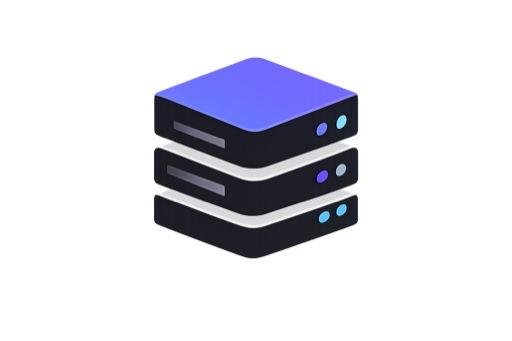
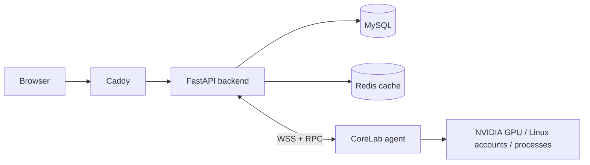

<p align="center">
  
</p>

# CoreLab

CoreLab 是一个面向小型实验室的自托管 GPU 预约与管理平台。它把 GPU 时段预约、Linux 账户关联、定时脚本、服务器接入、合规告警和操作审计放在同一个系统里，适合原本依靠群消息、共享表格和口头约定分配机器的团队。

项目目前已经具备完整的 Web、API、数据库和 agent 实现，并通过了无 GPU 环境下的单元测试、集成测试、模拟 agent 和浏览器流程测试。真实 Linux/NVIDIA 主机的最终验收尚未完成，因此部署到正式实验室前，仍应先选一台非关键机器试运行。

## 可以做什么

- 在服务器、GPU 和时间组成的网格上创建独占或共享预约，提交前检查时间和容量冲突。
- 给预约附加启动脚本，到点后由服务器 agent 使用关联的 Linux 账户执行，并在网页中查看状态和输出日志。
- 通过 SSH 挑战、管理员确认等方式，把平台用户与服务器上的 Linux 账户建立可审计的关联。
- 生成邀请注册链接。被邀请人自行填写用户名、邮箱、显示名、密码和可选 SSH 公钥，管理员不需要预先代建账号。
- 使用一次性 enrollment token 部署 agent；agent 首次回连后保持 pending，管理员核对主机信息并批准后才进入受信状态。
- 自动发现 GPU、Linux 账户和 authorized keys，展示遥测数据，并按策略产生告警或执行经过授权的处置动作。
- 记录预约、账号关联、能力开关、服务器审批等重要写操作。运行时数据库账户不能修改或删除审计记录。

## 运行结构



- 前端：Vue 3、TypeScript、Vite、Pinia、Naive UI
- 后端：FastAPI、SQLAlchemy 2、Alembic、APScheduler
- 数据：MySQL 8 为事实来源，Redis 只保存限流、nonce 和调度锁等短期状态
- 主机端：Python agent 通过 WebSocket 上报状态并执行受能力开关约束的 RPC
- 部署：Docker Compose 构建前端和后端，由 Caddy 统一提供 Web、API 和 WebSocket 入口

更完整的组件边界和业务流见 [架构说明](docs/architecture.md)。

## 快速启动

控制平面需要 Docker Compose、OpenSSL 和 curl。建议先自行安装 Docker，再运行：

```bash
git clone https://github.com/Johnny-xuan/CoreLab.git
cd CoreLab
./deploy/install.sh --no-auto-install
```

安装脚本会生成 `deploy/.env` 中的随机密钥、构建并启动容器，然后打印可访问地址。第一次打开页面时，初始化向导会要求创建实验室和首位管理员。

也可以手动启动：

```bash
cd deploy
cp .env.example .env
# 将 .env 中四个 __GENERATE_ME__ 占位值替换为随机密钥
docker compose up -d --build
```

默认入口为 `http://localhost`，MySQL 仅映射到宿主机回环地址 `127.0.0.1:3307`。需要跨机器接入 agent 时，应在 `deploy/.env` 中设置其他主机能访问的 `BACKEND_PUBLIC_URL`。

## 首次使用顺序

1. 在初始化向导创建实验室和管理员。
2. 进入服务器管理页，登记预期主机名并生成 agent 安装命令。
3. 在 GPU 主机执行命令，等待 agent 回连；核对主机信息后由管理员批准。
4. 确认 GPU 和 Linux 账户已被发现，按需调整服务器能力和合规策略。
5. 邀请其他用户注册；用户添加 SSH 公钥并申请或验证自己的 Linux 账户。
6. 从账户工作区创建预约，按需附加脚本，再从“我的预约”和“我的脚本”跟踪执行结果。

公网部署、TLS、备份、升级和 agent 主机要求见 [部署指南](docs/deployment.md)。

## 本地开发

开发环境需要 Python 3.11、[uv](https://docs.astral.sh/uv/)、Node.js 20 以上和 pnpm 9 以上。

```bash
uv sync --frozen --all-packages
cd frontend && pnpm install --frozen-lockfile
```

常用检查：

```bash
make check
make test-python
make test-frontend
make test-integration
```

`make test-integration` 会在 3308/6380 端口启动一次性的 MySQL 与 Redis，执行迁移和后端测试，完成后删除测试数据。开发约定见 [贡献指南](CONTRIBUTING.md)。

## 当前边界

- 真实 NVIDIA 主机尚未完成最终验收，危险能力默认关闭，首次部署请使用非关键服务器。
- 当前连接池和实时推送状态保存在单个后端进程内，暂不支持多后端实例水平扩展。
- 邀请链接由管理员复制给用户，项目本身不发送邮件。
- 共享预约负责时间和显存配额核算，不等同于 GPU 驱动或容器层面的强隔离。
- 默认 Caddy 配置只提供 HTTP，适合受信 LAN；跨公网使用必须增加 TLS。

安全边界和上线前检查见 [SECURITY.md](SECURITY.md)。

## License

CoreLab 使用 [Apache License 2.0](LICENSE)。
