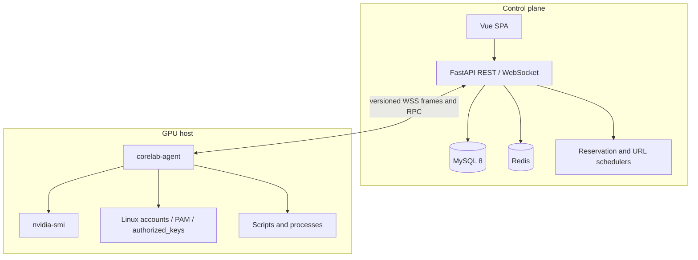

# 架构说明

## 组件边界

CoreLab 分成控制平面和主机端两部分。控制平面负责身份、预约、策略、审计和调度；agent 只负责读取主机事实并执行已经过后端授权的动作。

MySQL 是业务事实来源。Redis 只承载限流计数、SSH challenge nonce、调度锁和安装阶段的短期 URL 信息，丢失后不会破坏预约、账号或审计记录。backend-agent 消息模型集中定义在 `shared/protocol`，避免两端各自解释 JSON。

## 主要业务流

### 邀请注册

管理员创建一个带角色和有效期的注册链接，此时数据库中还没有目标用户。访问者打开链接后自行填写用户名、邮箱、显示名、密码和可选 SSH 公钥。后端在同一事务中检查 token、字段唯一性和公钥格式，创建用户并把邀请标记为已使用。链接可以在使用前由管理员撤销。

### 服务器接入

管理员先登记预期主机并取得一次性 enrollment token。agent 使用 token 首次回连后，后端签发长期 agent token，但服务器仍停留在 `pending`。待管理员核对主机名、agent 版本和回连状态并批准后，后端才接受 GPU 遥测、账户扫描和操作帧，并同步能力、策略和账户关联缓存。

### Linux 账户关联

平台用户和服务器上的 Linux 用户是两个独立身份。`physical_account` 保存 agent 发现的主机账户，`account_link` 表示某个平台用户已经证明或获准使用该账户。预约脚本必须基于有效关联，agent 才知道应以哪个 UID 执行。

关联可以来自 SSH challenge，也可以先由管理员确认，再由用户补做验证。撤销关联时保留原因和审计记录，并把新状态同步给在线 agent。

### 预约与脚本

预约指向一台服务器、可选 GPU、Linux 账户和时间区间。独占预约与同卡重叠预约互斥；共享预约按申请显存和算力比例检查容量。创建流程在数据库事务中重新检查冲突，前端预览只用于提前反馈，不能替代后端校验。

调度器把到时的预约从 scheduled 推进到 running，并通过 agent RPC 启动附带脚本。agent 回传 started、output chunk 和 finished 事件，后端保存脚本状态、退出码、日志路径和最近输出。结束、取消和超时状态也由同一生命周期处理。

### 合规与审计

agent 周期性读取 GPU 进程和 Linux 账户状态，按后端下发的策略判断未预约占用、超量使用等事件。自动 kill、用户增删等危险动作还要通过独立 capability gate，默认关闭。

所有重要写操作追加到 `audit_log`。应用层没有修改或删除接口；运行数据库账户没有 DELETE 权限，MySQL trigger 继续拒绝该账户对审计表的 UPDATE 和 DELETE。

## 数据模型分组

- 身份：`lab`、`user`、`ssh_public_key`、`registration_invite`、`setup_token`
- 主机：`server`、`enrollment_token`、`gpu`、`physical_account`、`authorized_key_entry`
- 授权：`account_link`、`account_link_request`、`server_admin_grant`
- 调度：`reservation`、`notification`
- 策略：`agent_capability`、`agent_policy`、`alert_event`
- 追责：`audit_log`

完整字段和约束以 Alembic migrations 与 SQLAlchemy models 为准。

## 扩展限制

在线 agent 连接、RPC correlation 和浏览器订阅保存在 backend 进程内。当前部署应保持单 backend 实例；若要水平扩展，需要把连接路由和实时事件扇出迁移到跨进程消息层。调度器也只适合单实例运行，虽然 Redis 锁可以避免部分重复执行，但还没有把整套服务设计为多活。
